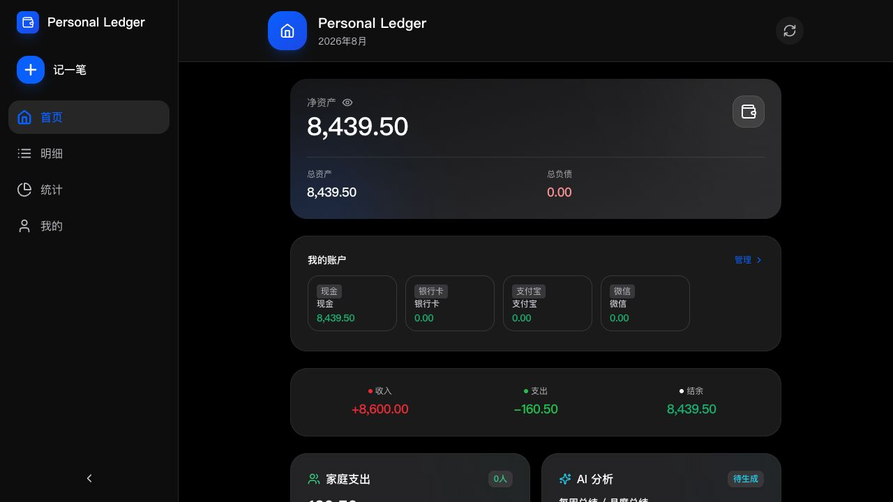
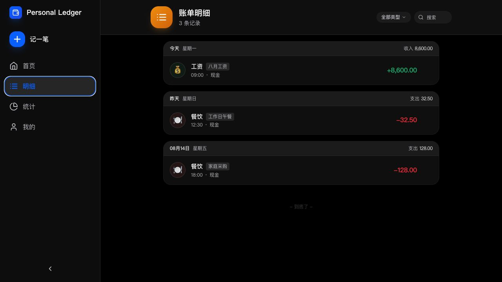
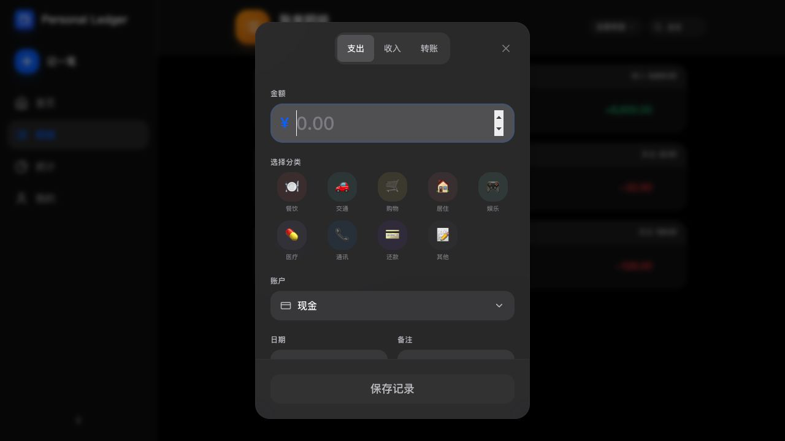
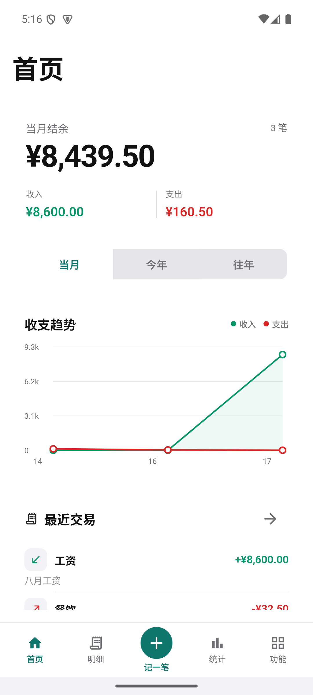
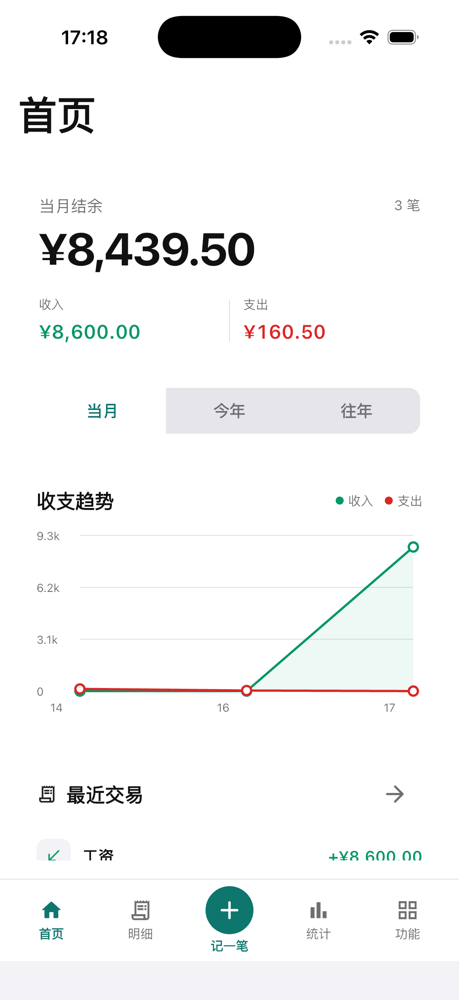

# Personal Ledger

Personal Ledger 是一个面向个人和家庭的私有部署记账系统。数据放在自己的服务器上，Web 和 Flutter 客户端通过同一套 Go API 访问。

当前 v1.0.8 以 Docker/Web 为正式发布主路径；Android 和 iOS 保留开发构建、模拟器/真机验证与运行截图，不要求本次发布配置商店签名。

## 运行截图

截图使用隔离 SQLite 和合成账本数据生成，不包含真实个人数据。

### Web

### Android

### iOS

截图证据和设备信息见 [v1.0.8 运行截图](docs/screenshots/v1.0.8/README.md)。

## 功能概览

- 交易：收入、支出、转账、搜索筛选、批量删除、附件和导入回滚。
- 账本：账户、分类、标签、快捷模板、预算、提醒、借贷和账户日志。
- 分析：统计总览、趋势、资产趋势、年度报表和 CSV 导出。
- 家庭：成员、成员归属交易、家庭汇总、成员统计和成员预算基础。
- AI：OpenAI-compatible Provider、报告生成、计划任务、脱敏快照和密钥保护。
- 运维：JSON 备份恢复、自动备份、通知通道、设备授权 API Token、健康检查和 Prometheus 指标。
- 安全：JWT、刷新令牌、scope、限流、CORS 白名单、安全响应头、审计日志和私网出站防护。

功能细节拆分在 [功能文档索引](docs/features/README.md)，不把所有实现说明塞进首页。

## 快速部署

需要 Docker Engine 和 Docker Compose v2。

    git clone https://github.com/sky121666/sky-PersonalLedger.git
    cd sky-PersonalLedger
    cp .env.example .env

编辑 .env，设置至少 32 字符的随机 JWT 密钥和首次初始化令牌：

    LEDGER_JWT_SECRET=<随机值>
    LEDGER_SETUP_TOKEN=<随机值>

`.env.example` 默认固定到 v1.0.8 的不可变镜像 digest；升级时请显式修改 `LEDGER_IMAGE`，不要依赖 `latest`。

生成随机值：

    openssl rand -base64 32
    openssl rand -hex 32

启动：

    docker compose up -d
    docker compose ps
    curl -fsS http://127.0.0.1:8080/api/v1/health

首次打开：

    http://localhost:8080/#/setup?setup_token=<LEDGER_SETUP_TOKEN>

默认持久化目录是 ./data，对应容器内的 /data：

    ./data/ledger.db
    ./data/uploads/
    ./data/backups/

完整部署说明见 [部署与配置](docs/development/deployment.md)。

## 客户端

### Web

Web 由同一个 Docker 容器提供；本地开发服务器默认监听 5173，并把 /api 代理到 localhost:8080。

    cd web
    pnpm install --frozen-lockfile
    pnpm dev

### Flutter

移动端输入账本服务器根地址，例如 https://ledger.example.com；客户端会自动追加 /api/v1。

    cd mobile
    flutter pub get
    flutter analyze
    flutter test
    flutter run

Android、iOS、macOS 和 Windows 的平台构建与验证说明见 [客户端开发](docs/development/clients.md)。

## 开发验证

提交前建议执行：

    ./scripts/check-public-git-safety.sh
    git diff --check

    cd backend && go test ./... && go vet ./...
    cd ../web && pnpm install --frozen-lockfile && pnpm test && pnpm build && pnpm verify:bundle
    cd ..
    ./scripts/verify-web-e2e.sh
    cd mobile && flutter analyze && flutter test
    cd ..
    ./scripts/verify-mobile-e2e.sh

完整门禁：

    RUN_EXPENSIVE=1 ./scripts/check-production-readiness.sh

本地最终验收（跳过正式签名和外部发布证据）：

    LOCAL_FINAL_RELEASE=1 ./scripts/check-final-release-gates.sh

## 发布边界

v1.0.8 正式 Release 只包含 Docker/Web 产物：

- GHCR 多架构镜像：linux/amd64、linux/arm64。
- Docker Compose 部署文件。
- Web 生产构建、浏览器 E2E、后端和安全契约证据。
- Android/iOS 运行截图和开发构建证据，不承诺商店分发。

发布工作流见 [v1.0.8 发布说明](docs/release/v1.0.8.md)。如果以后需要正式分发移动端，再阅读 [开发签名教程](docs/development/signing.md)。

## 数据安全

- 不要提交 .env、数据库、上传目录、备份、keystore、证书或 API Key。
- AI Provider 是可选功能；正常备份不会导出 Provider 密钥。
- 生产环境不要使用 CORS 星号，也不要未经审查地打开私网出站。
- 升级前备份 ./data，并保留旧镜像标签。

## 目录

| 目录 | 用途 |
| --- | --- |
| backend/ | Go、Gin、GORM 后端 |
| web/ | Vue 3、TypeScript、Vite Web |
| mobile/ | Flutter 原生客户端 |
| docs/features/ | 按功能拆分的用户与接口说明 |
| docs/development/ | 部署、开发、测试和签名教程 |
| docs/release/ | 版本发布说明与证据 |
| docs/screenshots/ | 脱敏运行截图 |
| scripts/ | 自动化门禁、备份演练和 E2E |

仓库当前没有 LICENSE 文件；如果公开分发，请补充明确的开源许可证。
