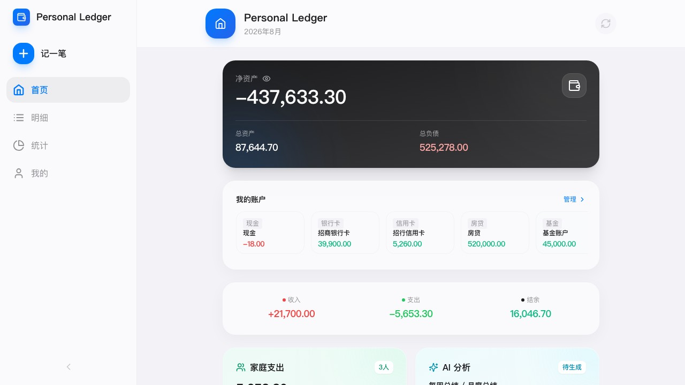
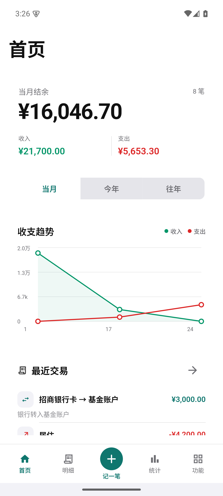
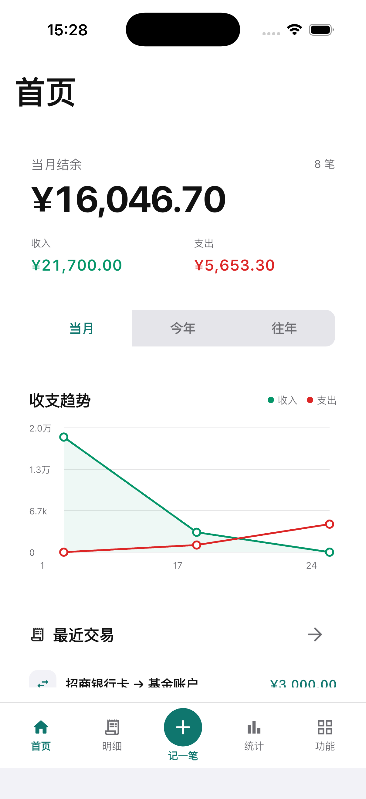

# Personal Ledger

Personal Ledger 是一个面向个人和家庭的私有部署记账系统。数据保存在自己的服务器，
Web 与 Flutter 客户端共用 Go API，适合单用户或家庭账本，不是 SaaS 多租户服务。

当前正式版本：**v1.0.9** · [发布说明](docs/release/v1.0.9.md) · [GitHub Release](https://github.com/sky121666/sky-PersonalLedger/releases/tag/v1.0.9)

## 运行截图

以下图片由 v1.0.9 当前源码连接隔离 SQLite 后端后实际采集，数据均为合成展示数据。

### Web



### Android



### iOS



账单明细、快速记账、设备与分辨率、生成方式和验证边界见
[v1.0.9 完整截图证据](docs/screenshots/v1.0.9/README.md)。

## 功能概览

| 领域 | 主要能力 | 详细文档 |
| --- | --- | --- |
| 记账 | 收入、支出、转账、筛选、批量删除、附件、导入回滚、CSV 导出 | [记账与账本](docs/features/accounting.md) |
| 账本 | 账户、分类、标签、快捷模板、预算、提醒、借贷、账户日志 | [记账与账本](docs/features/accounting.md) |
| 报表 | 统计总览、收支趋势、资产趋势、年度报表 | [记账与账本](docs/features/accounting.md) |
| 家庭 | 家庭成员、交易归属、家庭汇总、成员统计、成员预算基础 | [家庭与 AI](docs/features/family-ai.md) |
| AI 与通知 | OpenAI-compatible Provider、周报/月报、计划任务、企业微信、钉钉、SMTP、Webhook | [家庭与 AI](docs/features/family-ai.md) |
| 数据与安全 | JSON 备份恢复、自动备份、设备 API Token、审计、健康检查、Prometheus 指标 | [数据、安全与运维](docs/features/data-security.md) |
| 客户端 | Web、Android、iOS，以及 macOS/Windows 开发构建入口 | [客户端与验证](docs/features/clients.md) |

完整功能索引见 [docs/features](docs/features/README.md)。README 只保留产品入口和部署主路径。

## Docker 快速部署

v1.0.9 的正式发布范围是 Docker/Web。需要 Docker Engine、Docker Compose v2、Git、
OpenSSL 和校验工具。

### 1. 下载固定版本和发布 Compose

```bash
git clone --branch v1.0.9 --depth 1 https://github.com/sky121666/sky-PersonalLedger.git
cd sky-PersonalLedger
curl -fLO https://github.com/sky121666/sky-PersonalLedger/releases/download/v1.0.9/docker-compose-v1.0.9.yml
curl -fLO https://github.com/sky121666/sky-PersonalLedger/releases/download/v1.0.9/docker-compose-v1.0.9.yml.sha256
sha256sum -c docker-compose-v1.0.9.yml.sha256
cp .env.example .env
chmod 600 .env
```

macOS 可把最后的校验命令换成：

```bash
shasum -a 256 -c docker-compose-v1.0.9.yml.sha256
```

Release 附件中的 Compose 已固定到 v1.0.9 不可变镜像 digest。仓库根目录的
`docker-compose.yml` 与 `.env.example` 保留上一已验证 digest 作为源码演练基线；正式
安装 v1.0.9 应使用上面下载并校验过的版本专属 Compose，避免发布 digest 的循环依赖。

### 2. 生成本机密钥

下面三个命令分别执行。前两个 Base64 输出依次用于 JWT 和凭据加密主密钥，Hex 输出
用于首次初始化令牌；只写入本机 `.env`，不要粘贴到 Issue、日志或公开文档。

```bash
openssl rand -base64 32
openssl rand -base64 32
openssl rand -hex 32
```

在 `.env` 中填写：

```dotenv
LEDGER_JWT_SECRET=第一条随机值
LEDGER_CREDENTIAL_ENCRYPTION_KEY=第二条随机值
LEDGER_SETUP_TOKEN=第三条随机值
```

`LEDGER_CREDENTIAL_ENCRYPTION_KEY` 应从首次启动开始保持稳定，用于保护 AI Provider 和
通知凭据；轮换方法见 [部署与配置](docs/development/deployment.md)。

### 3. 启动和检查

```bash
docker compose --env-file .env -f docker-compose-v1.0.9.yml up -d
docker compose --env-file .env -f docker-compose-v1.0.9.yml ps
curl -fsS http://127.0.0.1:8080/api/v1/health
```

首次打开：

```text
http://localhost:8080/#/setup?setup_token=你在本机生成的初始化令牌
```

默认仅绑定 `127.0.0.1`。对外服务请使用 HTTPS 反向代理，不要把未加密 HTTP 直接暴露
到公网。持久化目录是 `./data`：

```text
data/ledger.db
data/uploads/
data/backups/
```

完整的反向代理、数据库、环境变量、升级、凭据迁移和回滚说明见
[部署与配置](docs/development/deployment.md)。

## 客户端与开发

Web 由正式 Docker 镜像一并提供。本地开发：

```bash
cd web
pnpm install --frozen-lockfile
pnpm dev
```

Flutter 客户端输入账本服务器根地址，例如 `https://ledger.example.com`；客户端会自动
使用 `/api/v1`。本地开发：

```bash
cd mobile
flutter pub get
flutter analyze
flutter test
flutter run
```

Android、iOS、macOS、Windows 的构建入口、网络安全限制和真实后端 E2E 见
[客户端开发](docs/development/clients.md)。正式签名不是 Docker/Web 发布的前置条件；
只有需要分发移动安装包时才使用 [签名教程](docs/development/signing.md)。

## 开发验证

```bash
./scripts/check-public-git-safety.sh
./scripts/check-version-consistency.sh
./scripts/check-toolchain-consistency.sh
git diff --check

cd backend && go test ./... && go vet ./...
cd ../web && pnpm install --frozen-lockfile && pnpm test && pnpm build && pnpm verify:bundle
cd .. && ./scripts/verify-web-e2e.sh
cd mobile && flutter analyze && flutter test
cd .. && ./scripts/verify-mobile-e2e.sh
```

完整本地门禁：

```bash
RUN_EXPENSIVE=1 ./scripts/check-production-readiness.sh
LOCAL_FINAL_RELEASE=1 ./scripts/check-final-release-gates.sh
```

项目版本以根目录 `VERSION` 为准；Web 和 Flutter 版本字段、Node、Go、Flutter 与 Docker
工具链均由 CI 校验。

## v1.0.9 发布边界

- 正式产物：GHCR `linux/amd64`、`linux/arm64` 镜像，以及 digest 固定的 Compose 和 SHA-256 附件。
- Web：生产构建、单元测试、真实后端 Playwright 和发布镜像运行检查纳入正式门禁。
- Android/iOS：当前源码已通过模拟器真实后端 E2E 并提供运行截图，但不附带签名 APK、AAB、IPA，也不声称实体 iPhone 或商店验收完成。
- 附件维护屏障是进程内机制；共享同一上传目录时仅支持一个可写应用实例，多副本写入需要外部分布式租约，当前不支持。
- 仓库当前没有 `LICENSE` 文件；源码公开可见不等于已经授予明确的开源许可证。

发布流程和远端保护见 [发布治理合同](docs/development/release-governance.md)。

## 数据安全

- 不要提交 `.env`、数据库、上传目录、备份、keystore、证书或 API Key。
- 备份格式 2.3 不导出 AI Provider 或通知凭据；附件内容仍是敏感明文数据的 Base64 表示。
- 升级前备份 `data/` 与受限的本机 `.env`，并保留旧镜像 digest。
- AI、Webhook、SMTP 私网出站默认阻止；确有内网网关需求时再显式开启并限制范围。

## 文档导航

| 目录 | 内容 |
| --- | --- |
| [docs/features](docs/features/README.md) | 用户功能与接口边界 |
| [docs/development](docs/development) | 部署、客户端、测试、签名与发布治理 |
| [docs/architecture](docs/architecture) | 家庭、AI、备份与存储合同 |
| [docs/release](docs/release) | 每个正式版本的范围、变更和限制 |
| [docs/screenshots](docs/screenshots/README.md) | 脱敏运行截图与采集证据 |
| [docs/quality](docs/quality) | 门禁、演练和验收边界 |

贡献规范见 [CONTRIBUTING.md](CONTRIBUTING.md)，安全问题请按
[安全策略](.github/SECURITY.md) 私密报告。
